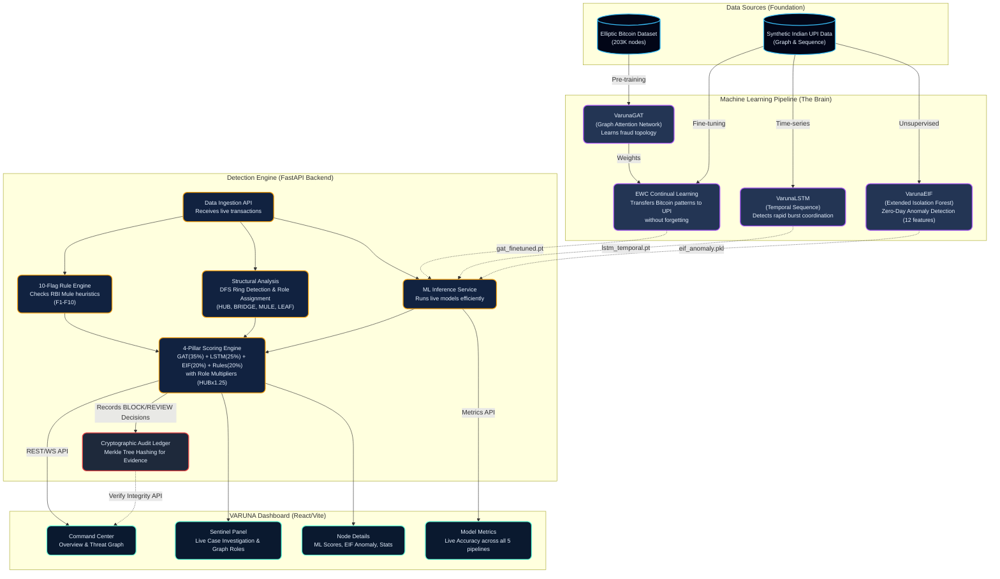

# VARUNA Enterprise Architecture

This diagram illustrates the final, production-grade VARUNA fraud interception system. It integrates deep learning, structural graph analysis, zero-day anomaly detection, and cryptographic compliance to create a highly resilient National Fraud Interception Command Center.

The system is split into four primary layers: **Data Foundation, Machine Learning Core, Detection Backend, and Frontend Dashboard**.

### Understanding the Flow (Enterprise Edition)

1. **Data Foundation:** We use the massive **Elliptic Bitcoin Dataset** to learn universal mathematical shapes of money laundering (graph topology). We also use **Synthetic UPI data** representing Indian mule patterns.
2. **Machine Learning Brain (4 Pillars):** 
   - **VarunaGAT** learns exactly what a fraud network "looks" like.
   - **EWC (Elastic Weight Consolidation)** carefully adapts the Bitcoin-trained GAT model to the UPI data, ensuring it remembers global fraud patterns while learning local Indian characteristics.
   - **VarunaLSTM** acts like a stopwatch, learning to spot the rapid, coordinated burst timing of human mules moving money.
   - **VarunaEIF (Isolation Forest)** acts as a safety net, using 12 expanded structural features to catch zero-day anomalies that the other supervised models have never seen before.
3. **Detection Engine (Backend):** When a transaction comes in, it splits into three analytical paths:
   - **10-Flag internal engine** checks for heuristic hits (like zero-washout or dormant spikes).
   - **Structural Analysis** uses localized DFS to find cycles/rings and assigns strategic roles (HUB, BRIDGE, MULE).
   - **ML Inference Service** passes the subgraph to GAT, LSTM, and EIF.
   Finally, the **4-Pillar Scoring Engine** calculates a combined risk score out of 100, heavily amplifying the risk if the node is assigned a central coordination role like a **HUB** or **BRIDGE**.
4. **Cryptographic Compliance:** If the scoring engine decides to `BLOCK` or flag for `REVIEW`, the data is immediately sent to the **Merkle Audit Ledger**. This creates a tamper-proof, SHA-256 hashed chain of evidence required for legal/financial compliance.
5. **VARUNA Dashboard (Frontend):** The combined intelligence is pushed to the React frontend, populating the interactive Threat Graph with new Role labels, highlighting zero-day anomalies, providing 5 distinct ML performance metric cards, and allowing real-time audit ledger verification.
